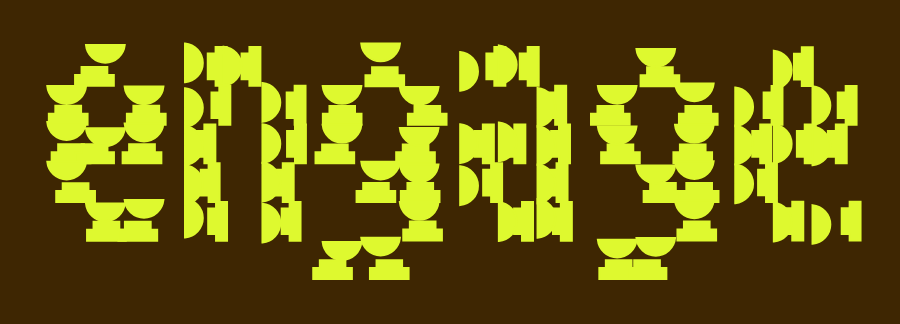
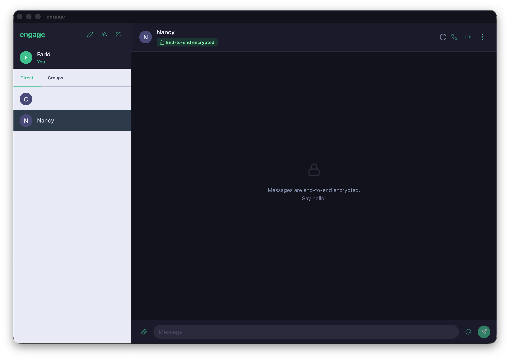

<p align="center">
  
</p>

---

End-to-end encrypted desktop chat — built with Tauri 2, Vue 3, and Rust.



Messages are encrypted on your device before leaving it. The relay server forwards sealed envelopes and never has access to plaintext. Identity is verified via Google OAuth; sessions are authenticated with JWTs.

> **Author:** [@faridguzman91](https://github.com/faridguzman91)

---

## Architecture

```
┌──────────────────────────┐        ┌────────────────────────────┐
│   engage (this repo)     │        │   engage-server            │
│                          │        │                            │
│  Vue 3 + PrimeVue UI     │  WSS   │  Axum relay server         │
│  ├─ Pinia stores         │◄──────►│  ├─ Google OAuth + JWT     │
│  ├─ Vue Router           │  HTTPS │  ├─ Key distribution API   │
│  └─ Tauri IPC bridge     │        │  ├─ Sealed message relay   │
│                          │        │  ├─ Group fan-out          │
│  Rust backend (Tauri)    │        │  └─ WebSocket push         │
│  ├─ X3DH key agreement   │        │                            │
│  ├─ Double Ratchet       │        │  SQLite (server-side)      │
│  ├─ Sender Keys (groups) │        │  (stores only ciphertext)  │
│  └─ SQLite (local)       │        └────────────────────────────┘
└──────────────────────────┘
```

### Cryptography stack

| Primitive | Role | Crate |
|---|---|---|
| X25519 | Key agreement (X3DH + Double Ratchet DH steps) | `x25519-dalek` |
| Ed25519 | Signed prekey signatures | `ed25519-dalek` |
| AES-256-GCM | 1:1 + group message encryption | `aes-gcm` |
| HKDF-SHA256 | Key derivation (X3DH, ratchet KDF, Sender Key ratchet) | `hkdf` / `sha2` |
| Sender Keys | Group message encryption — one encrypt, N recipients | `aes-gcm` |
| HS256 JWT | Session authentication | `jsonwebtoken` |

The full [X3DH](https://signal.org/docs/specifications/x3dh/) + [Double Ratchet](https://signal.org/docs/specifications/doubleratchet/) + Sender Keys protocol is implemented in pure Rust in `src-tauri/src/crypto/`.

---

## Frontend — PrimeVue UI

The entire interface is built with **[PrimeVue 4](https://primevue.org)** on the **Aura** design preset, themed with a Signal-inspired dark palette.

### Design system

| Token | Value | Usage |
|---|---|---|
| Accent / sent bubbles | `#3ebf8c` | Signal green — brand, sent messages, buttons |
| Received bubbles | `#2a2a3c` | Deep navy |
| Sidebar | `#1e1e2e` | Contact list background |
| Main surface | `#12121c` | Chat area background |
| Header / composer | `#1a1a2a` | Top bar and message input tray |

Dark mode is applied globally via PrimeVue's `darkModeSelector: ".dark"` — the `.dark` class is added to `<html>` on app mount.

### Screens

| Screen | Route | PrimeVue components |
|---|---|---|
| **Login** | `/login` | `Card`, `Button` (Google icon slot) |
| **OAuth callback** | `/auth` | `ProgressSpinner` — extracts token from URL, navigates |
| **Setup** | `/setup` | `Card`, `FloatLabel`, `InputText`, `Button`, `Message` |
| **Chat (1:1)** | `/chat/:id` | Two-panel shell with `MessageThread` |
| **Chat (group)** | `/group/:id` | `GroupView` — `AvatarGroup` header, sender names |
| **Settings** | `/settings` | `Panel` (collapsible keys), `Avatar`, `Tag`, `Button`, `Divider` |

### Components

#### `ConversationList`
- Brand header with `pi-pencil` (new 1:1), `pi-users` (new group), `pi-cog` (settings)
- Self-identity chip with `Avatar` + name + "You" tag
- **Tabs** — "Direct" and "Groups" sections, each with contact/group rows
- **"New conversation"** — `Dialog` with name + identity key inputs
- **"New group"** — `Dialog` with group name + member picker (checkboxes over contacts)

#### `MessageThread` (1:1)
- Header: contact `Avatar`, name, E2E encrypted `Tag`, disappear timer picker (`pi-clock` + `Select`)
- Green banner when disappearing messages are active
- Signal-style bubbles with timestamp, delivery checkmark, and expiry countdown badge
- Composer: attach (disabled), pill `InputText`, emoji (disabled), send button

#### `GroupView` (groups)
- Header: `pi-users` circle icon, group name, `AvatarGroup` of members, member count
- **Sender name** shown above each received bubble in the thread
- Same composer bar as 1:1, but encrypts with Sender Keys (one encrypt → all members)

### Icons
`pi-pencil` · `pi-users` · `pi-cog` · `pi-lock` · `pi-send` · `pi-check` · `pi-check-circle` · `pi-phone` · `pi-video` · `pi-paperclip` · `pi-face-smile` · `pi-comments` · `pi-user-plus` · `pi-key` · `pi-sign-out` · `pi-arrow-left` · `pi-ellipsis-v` · `pi-clock`

### Customising the theme

```css
/* src/styles/global.css — .dark selector */
.dark {
  --p-primary-color:         #your-color;
  --p-primary-hover-color:   #your-hover;
  --p-primary-active-color:  #your-active;
  --engage-accent:           #your-color;
  --engage-sent-bg:          #your-color;
}
```

---

## Repository layout

```
engage/
├── Makefile                        # make dev / server / client / docker-up
├── docker-compose.yml              # Compose file for the relay server
├── src/
│   ├── config.ts                   # Server URL (VITE_SERVER_URL env var)
│   ├── main.ts                     # PrimeVue + Pinia + Router setup
│   ├── styles/global.css           # Design tokens, PrimeVue dark overrides
│   ├── router/index.ts             # Auth + identity route guards
│   │
│   ├── stores/
│   │   ├── auth.ts                 # JWT storage, Google OAuth (webview navigation)
│   │   ├── identity.ts             # Key generation, server registration, WS connect
│   │   ├── contacts.ts             # Contact CRUD + X3DH session init
│   │   ├── messages.ts             # Send (encrypt → relay) / receive (decrypt)
│   │   └── groups.ts               # Group CRUD, Sender Key distribute/encrypt/decrypt
│   │
│   ├── composables/
│   │   ├── useWebSocket.ts         # WS singleton — 1:1 + group message dispatch
│   │   ├── useServerApi.ts         # Typed fetch — Bearer token, group API
│   │   ├── useOpkReplenishment.ts  # OPK pool check → generate → upload
│   │   ├── useDisappearingMessages.ts # TTL timers, sweep, countdown
│   │   └── useCrypto.ts            # Thin Tauri command wrappers
│   │
│   ├── views/
│   │   ├── LoginView.vue           # Google sign-in card
│   │   ├── AuthCallbackView.vue    # OAuth callback — extracts ?token= from URL
│   │   ├── SetupView.vue           # Display name + key generation
│   │   ├── ChatView.vue            # Two-panel shell (1:1)
│   │   ├── GroupView.vue           # Group conversation thread
│   │   └── SettingsView.vue        # Profile, keys, sign out
│   │
│   └── components/
│       ├── ConversationList.vue    # Sidebar — Direct/Groups tabs, new dialogs
│       └── MessageThread.vue      # 1:1 bubbles + disappear timer + composer
│
└── src-tauri/
    ├── src/
    │   ├── crypto/
    │   │   ├── x3dh.rs             # X3DH key agreement (initiator + recipient)
    │   │   ├── ratchet.rs          # Double Ratchet (encrypt/decrypt, skipped keys)
    │   │   ├── session.rs          # Session manager — X3DH→Ratchet, persists to SQLite
    │   │   ├── sender_key.rs       # Sender Keys — group encrypt/decrypt, ratchet
    │   │   ├── identity.rs         # Identity bundle generation
    │   │   └── keys.rs             # X25519 / Ed25519 helpers
    │   ├── commands/
    │   │   ├── identity.rs         # create_identity, get_identity
    │   │   ├── contacts.rs         # list/add/remove_contact
    │   │   ├── messages.rs         # list_messages, send_message
    │   │   ├── crypto.rs           # init_session, init_inbound_session,
    │   │   │                       # encrypt/decrypt_message, generate_prekey_bundle
    │   │   ├── prekeys.rs          # get_opk_status, generate_and_store_opks
    │   │   ├── disappear.rs        # get/set_disappear_timer, sweep_expired_messages
    │   │   └── groups.rs           # cache_group, encrypt/decrypt_group_message,
    │   │                           # get/store_sender_key_distribution
    │   └── storage/db.rs           # SQLite schema + WAL migrations
    └── tauri.conf.json             # engage:// deep-link scheme (production)
```

---

## Quick start

### Option A — Makefile (recommended for development)

```bash
# Clone both repos side-by-side
git clone git@github.com:faridguzman91/rust-engage.git engage
git clone --branch engage-server git@github.com:faridguzman91/rust-engage.git engage-server

# Configure server credentials
cd engage-server && cp .env.example .env
# Edit .env: fill in GOOGLE_CLIENT_ID, GOOGLE_CLIENT_SECRET, JWT_SECRET, FRONTEND_URL

# Start server + client simultaneously
cd ../engage && make dev
```

### Option B — Docker Compose (server) + native client

```bash
# Start the server in a container
cd engage && make docker-up

# Run the desktop client natively
make client
```

### Option C — Manual

See the step-by-step instructions below.

---

## Prerequisites

| Tool | Version | Notes |
|---|---|---|
| Rust | ≥ 1.76 | Install via [rustup](https://rustup.rs) |
| Node.js | ≥ 18.12 | Recommend Node 22 LTS via [nvm](https://github.com/nvm-sh/nvm) |
| **pnpm** | **≥ 9** | See platform notes below — npm is not used |
| Docker | 24+ | Only for `make docker-up` |
| C linker | — | **macOS:** Xcode CLT · **Windows:** see toolchain note below · **Linux:** `build-essential` |

### macOS toolchain note

```bash
# 1. Xcode Command Line Tools (provides clang + linker)
xcode-select --install

# 2. Rust
curl --proto '=https' --tlsv1.2 -sSf https://sh.rustup.rs | sh
source "$HOME/.cargo/env"

# 3. Node.js 22 via nvm (recommended)
curl -o- https://raw.githubusercontent.com/nvm-sh/nvm/v0.39.7/install.sh | bash
nvm install 22 && nvm use 22

# 4. pnpm via corepack (bundled with Node)
corepack enable
corepack prepare pnpm@9.15.9 --activate
```

#### macOS-specific gotchas

**`._*` resource fork files** — macOS generates hidden `._*` metadata files on volumes that don't support HFS+ extended attributes (e.g. exFAT external drives). If you clone onto such a volume, delete them before building:

```bash
find . -name "._*" -delete
```

They are listed in `.gitignore` so they won't be tracked. The `Makefile` also sets `CARGO_TARGET_DIR=$HOME/.cargo-targets/engage` to keep all Rust build output on local disk, preventing the issue from recurring in the build cache.

**Deep link scheme** — `tauri-plugin-deep-link` does not support runtime `register()` on macOS. The `engage://` URL scheme is declared statically in the app bundle via `tauri.conf.json` → `Info.plist`. No action required; this is handled automatically.

### Windows-specific toolchain note

This project targets `x86_64-pc-windows-gnu`. Full Visual Studio Build Tools are **not** required:

1. **GCC 14** is the linker driver — provides `libgcc`, `libmingwex`, etc.
2. **`rust-lld`** (bundled with Rust) is the actual linker — no PE ordinal limit.
3. `cdylib` is excluded from the crate type on desktop to avoid the 65535-export PE limit.

```powershell
scoop install mingw          # GCC 14.2.0
scoop install nodejs-lts     # Node 22 LTS
corepack enable
corepack prepare pnpm@9.15.9 --activate
rustup toolchain install stable-x86_64-pc-windows-gnu
rustup override set stable-x86_64-pc-windows-gnu   # run inside src-tauri/
```

The `.cargo/config.toml` at the repo root applies `-fuse-ld=lld` automatically.

---

## Manual setup

### 1. Clone

```bash
git clone git@github.com:faridguzman91/rust-engage.git
cd rust-engage
```

### 2. Set up Google credentials

#### OAuth 2.0 client

1. Go to [Google Cloud Console](https://console.cloud.google.com/) → **APIs & Services** → **Credentials**
2. Create an **OAuth 2.0 Client ID** — application type: **Web application**
3. Add `http://localhost:3000/api/auth/google/callback` to **Authorized redirect URIs**
4. Copy the client ID and secret into the server's `.env` file

#### Enable required APIs

In **APIs & Services → Library**, enable both:

| API | Used for |
|---|---|
| **Google People API** | Gmail contact import (`Find from Gmail` feature) |
| **Google Identity** | Already enabled when you create an OAuth client |

#### OAuth consent screen scopes

In **APIs & Services → OAuth consent screen → Edit App → Scopes**, add:

| Scope | Purpose |
|---|---|
| `openid` | Identity token |
| `email` | Login identity |
| `profile` | Display name |
| `https://www.googleapis.com/auth/contacts.readonly` | Read Gmail contacts for the import feature |

> If your app is in **Testing** mode, add your Google account under **Test users**.

### 3. Configure and start the relay server

```bash
git clone --branch engage-server git@github.com:faridguzman91/rust-engage.git engage-server
cd engage-server && cp .env.example .env
# Edit .env — fill in GOOGLE_CLIENT_ID, GOOGLE_CLIENT_SECRET, JWT_SECRET, FRONTEND_URL
cargo run
```

### 4. Start the client

```bash
pnpm install
pnpm tauri dev
```

### 5. First run — user flow

```
Launch app
  └─► /login  →  "Continue with Google"
        └─► Tauri webview → Google consent
              └─► Server issues JWT → localhost:1420/#/auth?token=JWT
                    └─► AuthCallbackView stores token → /setup
                          └─► Enter display name → keys generated + registered
                                └─► /chat → Ready to message
```

---

## Configuration

### Frontend

```env
# .env.local
VITE_SERVER_URL=http://localhost:3000
```

### Server

| Variable | Description |
|---|---|
| `GOOGLE_CLIENT_ID` | From Google Cloud Console |
| `GOOGLE_CLIENT_SECRET` | From Google Cloud Console |
| `JWT_SECRET` | Long random string — `openssl rand -hex 32` |
| `FRONTEND_URL` | **Dev only** — `http://localhost:1420` (OAuth redirects into Vite) |

Full reference: [engage-server/.env.example](https://github.com/faridguzman91/rust-engage/blob/engage-server/.env.example)

---

## Message flows

### 1:1 messages (Double Ratchet)

```
Alice                             Server                    Bob
─────                             ──────                    ───
fetchPreKeyBundle(bob_id) ──────► GET /api/keys/bob ──────► public keys
X3DH key agreement → shared_secret + EK_A
init Double Ratchet
encrypt("hello") via ratchet
POST /api/messages ─────────────► store ciphertext ────────► push via WebSocket
{ ciphertext, EK_A, JWT }         (never decrypts)           X3DH receive (EK_A)
                                                              init Double Ratchet
                                                              decrypt → "hello"
```

### Group messages (Sender Keys)

```
Alice creates group "Team" with Bob, Carol
  └─► distribute SenderKey to Bob (encrypted via pairwise ratchet)
  └─► distribute SenderKey to Carol (encrypted via pairwise ratchet)

Alice sends "Hello team!":
  encrypt("Hello team!") with Alice's SenderKey → one ciphertext
  POST /api/groups/:id/messages
    └─► server stores row for Bob, row for Carol (same ciphertext)
    └─► pushes via WS to Bob and Carol if online

Bob receives:
  decrypt with Alice's stored SenderKey → "Hello team!"
  Alice's SenderKey ratchets forward on Bob's side
```

---

## Authentication flow

```
Tauri webview                   Server                    Google
─────────────                   ──────                    ──────
window.location.href ─────────► GET /api/auth/google ──► OAuth consent
                                POST token exchange  ──► Google id_token + access_token
                                Store access_token, refresh_token in DB
                                issue HS256 JWT
Dev:  redirect ◄─────────────── localhost:1420/#/auth?token=JWT
Prod: redirect ◄─────────────── engage://auth?token=JWT
JWT stored in localStorage
All requests: Authorization: Bearer JWT
WS: /ws/:userId?token=JWT
```

---

## Gmail contact import flow

The **Find from Gmail** button (Google icon in the sidebar header) discovers which of your existing Gmail contacts are already on engage.

```
Client (JWT)                    Server                         Google
────────────                    ──────                         ──────
GET /api/contacts/suggest ────► Load access_token from DB
                                If expired → POST token refresh ──► new access_token
                                GET people/me/connections ────────► email addresses
                                SELECT users WHERE email IN (...)
                                (excludes self, excludes unregistered)
                         ◄───── [{ userId, displayName, identityKey, email }]
Show suggestions dialog
  └─► user clicks "Add"
        └─► addContact(identityKey, displayName)
              └─► X3DH session init on next message
```

**Token lifecycle** — The server stores the Google `access_token` and `refresh_token` from the OAuth exchange. Access tokens expire after 1 hour; the server refreshes automatically using the stored refresh token. If the refresh token is missing or revoked, the feature returns a "re-authentication required" message and the user signs out and back in.

**Privacy** — The server only reads email addresses from the People API, cross-references them against its own `oauth_accounts` table, and discards the rest. No contact data is stored.

---

## Production build

```bash
pnpm tauri build
```

Binaries → `src-tauri/target/release/bundle/`

For production: use HTTPS, remove `FRONTEND_URL` (uses `engage://` deep-link), run the server behind nginx/Caddy.

---

## Tech stack

| Layer | Technology |
|---|---|
| Desktop shell | [Tauri 2](https://tauri.app) |
| Frontend framework | [Vue 3](https://vuejs.org) + TypeScript |
| **UI component library** | **[PrimeVue 4](https://primevue.org) — Aura preset + PrimeIcons** |
| State management | [Pinia](https://pinia.vuejs.org) |
| Routing | [Vue Router 4](https://router.vuejs.org) |
| Package manager | [pnpm](https://pnpm.io) |
| Build tool | [Vite](https://vitejs.dev) |
| Crypto (1:1) | X3DH + Double Ratchet — x25519-dalek, ed25519-dalek, aes-gcm, hkdf |
| Crypto (groups) | Sender Keys — AES-256-GCM + HKDF ratchet |
| Auth | Google OAuth 2.0 + HS256 JWT |
| Local storage | SQLite via [rusqlite](https://github.com/rusqlite/rusqlite) (bundled) |
| Relay server | [Axum 0.7](https://github.com/tokio-rs/axum) + Tokio |
| Containerisation | Docker + Docker Compose |

---

## Makefile targets

| Target | What it does |
|---|---|
| `make dev` | Start relay server + Tauri client in parallel |
| `make server` | Start relay server only (`cargo run` in `../engage-server`) |
| `make client` | Start Tauri client only (`pnpm tauri dev`) |
| `make install` | Install/update frontend dependencies |
| `make build` | Production build (`pnpm tauri build`) |
| `make docker-up` | Start server via Docker Compose |
| `make docker-down` | Stop Docker Compose services |
| `make clean` | Remove Rust + frontend build artefacts |

---

## Roadmap

- [x] **E2E encryption** — X3DH key agreement + Double Ratchet (forward secrecy, break-in recovery)
- [x] **Authentication** — Google OAuth 2.0 + HS256 JWT; all API routes and WebSocket connections are protected
- [x] **Relay server** — zero-knowledge Axum server; stores and forwards sealed envelopes only
- [x] **Offline message drain** — messages queued server-side while recipient is offline, delivered on reconnect
- [x] **OPK replenishment** — auto-upload fresh one-time prekeys when pool drops below 10 (batch of 100)
- [x] **PrimeVue UI** — Signal-inspired dark theme built with PrimeVue 4 + Aura preset + PrimeIcons
- [x] **Disappearing messages** — per-conversation TTL; messages auto-delete on both sides after a set time
- [x] **Group messaging** — Sender Keys (Signal-style); one encrypt per message, server fans out to all members
- [x] **Gmail contact import** — "Find from Gmail" discovers which contacts are on engage via Google People API
- [ ] **Voice / video** — WebRTC peer connections + TURN server for NAT traversal
- [ ] **Mobile** — Tauri Android / iOS build target
